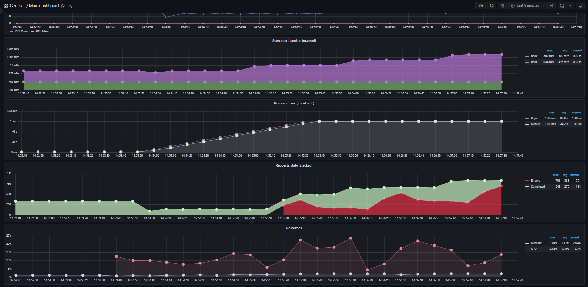
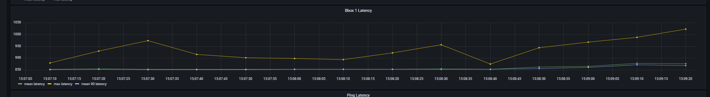
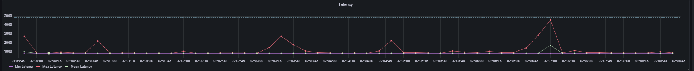

# Trabajo Práctico 1 - Arquitectura de Software

## 2° Cuatrimestre 2022

#### Integrantes

| Padrón  | Apellido y Nombre   |
|---------|---------------------|
| 99760   | Holota, Pavlo       | 
| 96454   | Caceres, Julieta    |
| 94165   | Prediger, Emiliano  |
| 98942   | Roselló, Jimena     |

## Sección 1

### Healthcheck básico

En esta primera instancia vamos a tratar de medir la performance de nuestro sistema realizando diferentes pruebas
de carga sobre el endpoint *ping* con el fin de someter al mismo a diferentes peticiones de requests y de esta manera 
comprender sus métricas y límites.

#### Escenario 1. Baseline - Un único nodo - Ping

En este primer escenario utilizamos una única instancia del sistema y el endpoint *ping* como baseline para consiguiente
análisis. Se pretende de esta forma, tener un caso base desde el cual luego ir desarrollando y comparando.

Para medir la performance del sistema se crea una prueba con la siguiente configuración:

***

([Link a imagen](img/ping/phases-baseline-ping.png))


El objetivo de esta configuración fue tener un escenario sin sobrecarga, que pudiese simular un escenario aceptable
para el sistema. Es por ello que se configuró de manera de tener 3 etapas, con números bajos de arrival rate. Con esto se espera poder un escenario liviano en carga del cual poder obtener algunas métricas
iniciales.


Se ejecuta la siguiente prueba:
***
    sh run-scenario.sh .\ping\baseline-ping.yml node

Y se obtienen los siguientes valores:

([Link a imagen](img/ping/throughput-baseline-ping.png)

En la imagen podemos ver que el throughput fue del 100%, no perdimos ningún mensaje y el mismo fue creciendo junto con 
la cantidad de request tal y como esperábamos.

En cuanto a la latencia podemos ver en el siguiente gráfico que la misma creció en la fase de Ramp Up, pero
se volvió a estabilizar cuando los request tuvieron un arrival rate constante.


([Link a imagen](img/ping/latencia-baseline-ping.png)

En cuanto al uso de los recursos del sistema, vemos que el isp de memoria es muy bajo y que el de CPU no supera
en promedio el 8%.


([Link a imagen](img/ping/resources-baseline-ping.png)

Debido a este aumento de latencia mencionado, nos preguntamos a partir de cuál valor de rate nuestro sistema comenzaría 
a quebrarse disminuyendo su throughput.

Para responder a esa pregunta, realizamos una prueba exploratoria de carga sobre este endpoint.

#### Escenario 2 - Búsqueda exploratoria de límite de carga Ping - Una única instancia

En este caso, como se mencionó en el escenario anterior, se realiza una prueba con una configuración diferente que
permita estimar a partir de que valores nuestro sistema comienza a empeorar su performance. 

La configuración propuesta para tal fin es la siguiente:


([Link a imagen](img/ping/stress-explorative-1.png)

Con esta configuración se decide arrancar con un arrivalRate igual al máximo propuesto para el baseline, ya que sabemos
que el sistema pudo soportarlo. Luego, se va a ir incrementando gradualmente la cantidad de virtual users de manera de
que la carga vaya creciendo y podamos ver como esto afecta a las diferentes métricas progresivamente.

Se ejecuta el siguiente comando:
***
    sh run-scenario.sh .\ping\explorative-stress-testing-ping.yml node

Los resultados obtenidos con esta configuración fueron:


([Link a imagen](img/ping/Throughput-ping-stress-1.png)

Se puede ver que en el segundo Ramp Up pasamos el sistema comienza a fallar gracias al gráfico de *Request State*. Esto
también se ve reflejado si miramos el gráfico de *Throughput* donde el RPS Count iba creciendo junto con la curva de request
pero en el segundo que se alcanza el quiebre la curva baja porque el server comienza a arrojar errores y los requests o
mensajes recibidos son dropeados.

Estos errores *Server Address in Use*, también se ven reflejados en la Latencia y tiempo de respuesta:


([Link a imagen](img/ping/latency-stress-1.png)


Fijarse como la latencia al final de la etapa de mayor carga había llegado a su valor maximo. Y, el response time, también
fue creciendo en esta ultima etapa:

([Link a imagen](img/ping/response_time_ping1.png)

En cuanto a los recursos también podemos ver que el consumo de CPU es significativamente más grande que en el ejemplo 
baseline que tomamos. Alcanzando valores máximos cercanos al 30% y un 17.8% en promedio:

([Link a imagen](img/ping/resourse-ping-stress-1.png)

#### Escenario 2 - Refinamiento de Request threshold para Ping - Una única instancia.

Sabemos que comenzamos a tener errores en el segundo Rump Up de la prueba anterior, es por eso que para poder refinar, 
partiremos esa fase en fases de carga progresiva para refinar el límite.

La configuración de la prueba a usar es la siguiente:


([Link a imagen](img/ping/refinamiento-stress-2.png)

Corriendo el comando:

***
    sh run-scenario.sh .\ping\explorative-stress-testing-ping.yml node

Vemos entonces que el sistema comienza a fallar desde el segundo Ramp Up donde el throughput decae significativamente:


([Link a imagen](img/ping/trhoghput-stress-ping-2.png)

Podemos decir entonces que nuestro límite de cargas está dentro del rango arrival de 150 a 200 en un minuto.

Para poder recibir más requests al mismo tiempo que este límite estimado, vamos a testear el sistema si fuese escalado
horizontalmente, para ello levantaremos mas replicas del mismo.

#### Escenario 3 - Test de Carga sobre el endpoint Ping - 3 réplicas

Comenzaremos levantando dos réplicas extra y someteremos este cluster al mismo test anterior para poder comparar:

***
    sh run-scenario.sh .\ping\explorative-stress-testing-ping2.yml cluster

Los resultados obtenidos son:


([Link a imagen](img/ping/errores-cluster.png)

En este caso la cantidad de request que terminan en error es menor (100 menos), pero no significativamente.
Sin embargo podríamos ver una mejora en el hecho de que el sistema comenzó a fallar mas tardíamente que en el caso anterior,
lo que significaría una pequeña mejora en el tiempo de disponibilidad del mismo.

Es interesante ver como tenemos picos constantes de latencia máxima que luego recaen significativamente. Es difícil
determinar el porqué del mismo exactamente, pero si puede darnos una idea que al revisar el consumo de memoria de uno de
los nodos, en uno de los momentos máximos de tiempo de demora en responder, el uso de CPU habia llegado casi a su límite:


([Link a imagen](img/ping/latency-resources-cluster.png)


### Endpoint Intensivo

Hasta ahora las pruebas realizadas fueron sobre el endpoint ping, pero en un sistema real, el sistema realiza trabajo 
ante cada llamada a un endpoint. Es por eso que se han creado dos endpoints que realizan un trabajo intensivo de CPU y
otro que hace trabajo de manera asincrónica para simular estos escenarios. 

En esta sección vamos a analizar los resultados de pruebas de estrés sobre el endpoint intensivo.

#### Escenario 1 - Baseline sobre el endpoint Intensivo - Una única instancia.

Para comenzar vamos a hacer algo parecido a lo que hicimos con el endpoint ping, iremos sometiendo el sistema a cargas
cada vez mayores de manera progresiva, con el objetivo de encontrar el límite del mismo.

La configuración de la prueba a usar es la siguiente:


([Link a imagen](img/intensivo/fases-preuba-1.png)

Ejecutando el comando:
***
     sh run-scenario.sh intensivo/explorative-stress-testing-intensivo.yaml node


Los resultados obtenidos fueron:


([Link a imagen](img/intensivo/fallas-prueba-1.png)

Es decir, ya en el primer Ramp Up el sistema comienza a lanzar errores del tipo Timeout:


([Link a imagen](img/intensivo/tipos-de-falla-prueba-1.png)

Esto se debe a que la CPU está al máximo en todo momento:

([Link a imagen](img/intensivo/capu-prueba-1.png))


Y por lo tanto el sistema comienza a dropear mensajes disminuyendo asi su throughput.

([Link a imagen](img/intensivo/throughput-prueba-1.png)

#### Escenario 2 - Test exploratorio de estrés sobre endpoint Intensivo - Una única instancia.

Para entender mejor el límite del sistema en el endpoint intensivo, bajamos la cantidad de arrivalRate en cada una de
las fases. La configuración de la prueba a usar es la siguiente:


([Link a imagen](img/intensivo/throughput-prueba-1.png)

***
     sh run-scenario.sh intensivo/explorative-stress-testing-intensivo-2.yaml node

Los resultados obtenidos fueron:


Como se puede ver el sistema comenzó a fallar manejando de entre 3 y 5 request al mismo tiempo. Lo cual tambien se ve 
reflejado en el Throughput que nunca supera el valor de 2


Nuevamente podemos observar que la CPU esta al máximo en todo momento:


Con lo cual para una única instancia vemos que el threshold del sistema es muy bajo.

#### Escenario 3- Test exploratorio de estrés sobre endpoint Intensivo - Más de una instancia.

En esta ocasión querríamos mejorar la cantidad de request que nuestro sistema puede manejar al mismo tiempo (al menos
en el sentido global, ya que no se escalara verticalmente sino horizontalmente). Para ello repetiremos las pruebas
realizadas pero esta vez con mas cantidad de replicas.

###### 3 Réplicas - Mejoras respecto a último test

Comenzaremos levantando 3 instancias en total de nuestro sistema node, y lo someteremos al mismo test anterior
para poder comparar:

***
     docker-compose up -d --build --scale node=4

     sh run-scenario.sh intensivo/explorative-stress-testing-intensivo-2.yaml cluster

Podemos ver que para un cluster de 3 instancias tuvimos mejoras, ya que todos los requests se procesaron correctamente


Mientras que la CPU en cada uno de los nodos, si bien tuvieron picos altos en la última fase de la prueba, nunca 
llegaron a su límite:


Es interesante ver como solo al final de la prueba, cuando mas carga se le dio al sistema, los 3 nodos trabajaron mas, 
mientras que al comienzo solo el nodo 2 (ultimo en la imagen) trabajo mas. Podriamos decir que la carga fue distribuida 
de manera inteligente para permitir la mejor performance del sistema.


###### Test exploratorio de estrés sobre endpoint Intensivo - Más de una instancia.

Como vimos, el cluster de 3 nodos es capaz de manejar mas requests que una única instancia, pero no sabemos aún cuál es su 
límite. Para ello tomaremos como baseline la primer prueba a la que sometimos al sistema con una única instancia.

Su configuración era:


Ejecutando el comando:
***
     sh run-scenario.sh intensivo/explorative-stress-testing-intensivo.yaml cluster

Obtenemos los siguientes resultados:


Vemos que el sistema comienza a fallar ni bien arranca el test, con lo cual el límite está más bajo que lo demandado en 
nuestra prueba. Por supuesto, el uso de CPU en los nodos termina siendo excesivo:


### Endpoint Asincrónico

Ahora pasaremos a analizar el endpoint asincrónico. Para ello, comenzaremos utilizando el mismo test que utilizamos para
el caso de endpoint intensivo, asi podremos comparar los resultados.

#### Escenario 1 - Test exploratorio baseline sobre endpoint Asincrónico - Una única instancia.

Comenzamos con la siguiente configuración de fases:


```yaml
 phases:
    - name: Plain 1
      duration: 60
      arrivalRate: 10
    - name: Ramp up 1
      duration: 60
      arrivalRate: 10
      rampTo: 30
    - name: Plain 2
      duration: 120
      arrivalRate: 30
    - name: Ramp up 2
      duration: 120
      arrivalRate: 30
      rampTo: 50
    - name: Plain 3
      duration: 120
      arrivalRate: 50
```


***
     sh run-scenario.sh intensivo/explorative-stress-testing-async.yaml node


con esta configuración se llegaron a completar todos los request y notamos una diferencia en cuanto al endpoint intensivo 
donde el uso de CPU habia sido extensivo y en este caso no supera el 8%


En cuanto a la tencia, la misma se mantuvo constante a lo largo de las fases, sin afectar el tiempo de respuesta de lso requests


#### Escenario 2 - Test exploratorio de estrés sobre endpoint Asincrónico - Una única instancia.

Para esta prueba iremos subiendo la cantidad de virtual users de manera gradual para ver como afectan a la performance
del sistema y poder estimar asi un threshold.

La configuración utilizada es la siguiente:

```yaml 
    phases:
    - name: Plain 1
    duration: 60
    arrivalRate: 50
    - name: Ramp up 1
    duration: 60
    arrivalRate: 50
    rampTo: 100
    - name: Plain 2
    duration: 60
    arrivalRate: 100
    - name: Ramp up 1
    duration: 60
    arrivalRate: 100
    rampTo: 150
    - name: Plain 2
    duration: 60
    arrivalRate: 150
    - name: Ramp up 1
    duration: 60
    arrivalRate: 150
    rampTo: 200
```    

Ejecutamos realizando: 

***
     sh run-scenario.sh intensivo/explorative-stress-testing-async-2.yaml node


Los resultados obtenidos fueron los siguientes:


Observamos que a comparación del endpoint intensivo, este puede procesar más requests sin terminar en error, llegando a 
soportar los requests de la fase de arrivalRate de entre 100 y 150 requests. Podemos asociar esto a que tenemos menor
consumo de CPU y a que se encolan menos cantidad de requests. En la imagen siguiente
podemos ver el consumo de CPU y el throughput a trevés del tiempo reflejando lo antes mencionado:


#### Escenario 3 - Test exploratorio de estrés sobre endpoint Asincrónico - Más de una instancia.

Nos interesa estudiar el comportamiento del sistema recibiendo requests asincrónicos cuando se agregan más instancias, 
para ello procederemos a ejecutar la misma prueba que antes, pero esta vez, con 3 réplicas:

***
     sh run-scenario.sh intensivo/explorative-stress-testing-async-2.yaml cluster

Los resultados obtenidos fueron los siguientes:


Es decir, comenzamos a tener errores después del segundo Ramp Up. Esto ya había sucedido cuando ejecutamos un único nodo
solo que el throughput era más bajo (se habían descartado más mensajes):


Podríamos pensar de esta manera que hemos mejorado en cuanto a requests procesados, pero sin embargo el sistema sigue 
estresado. Para mejorar esto podríamos intentar levantar más réplicas.

## Sección 2

Se procede a realizar diferentes pruebas sobre los endpoints de bbox para analizar así 
su comportamiento y determinar 
### Bbox0




Para estimar el numero de workers dividimos el throughput por la latencia y obtenemos los siguientes valores:

137 / 7.5 = 18.266666666666666

Concluimos entonces que el numero de workers debe ser 19.


por el arrival rate y obtenemos 2.5 workers por request.

#### Cantidad de workers (en el caso sincrónico)

### Bbox1






Demora en responder
