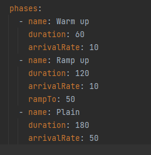
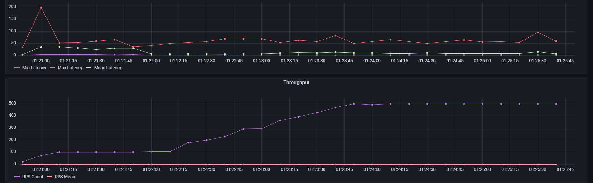
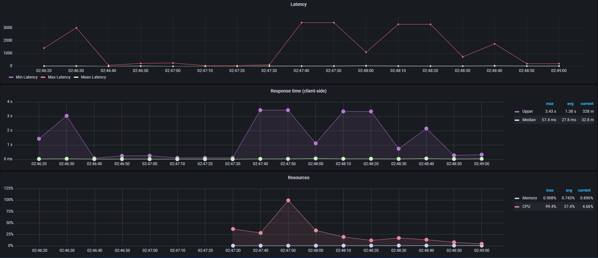

# Trabajo Práctico 1 - Arquitectura de Software

## 2° Cuatrimestre 2022

#### Integrantes

| Padrón  | Apellido y Nombre   |
|---------|---------------------|
| 99760   | Holota, Pavlo       | 
| 96454   | Caceres, Julieta    |
| 94165   | Prediger, Emiliano  |
| 98942   | Roselló, Jimena     |

## Sección 1

### Healthcheck básico

En esta primera instancia vamos a tratar de medir la performance de nuestro sistema realizando diferentes pruebas
de carga sobre el enpoint *ping* con el fin de someter al mismo a diferentes peticiones de requests y de esta manera 
comprender sus metricas y limites.

#### Escenario 1. Baseline - Un único nodo - Ping

En este primer escenario utilizamos una única instancia del sistema y el endpoint *ping* como baseline para consiguiente
análisis. Se pretende de esta forma, tener un caso base desde el cual luego ir desarrollando y comparando.

Para medir la performance del sistema se crea una prueba con la siguiente configuración:

***

([Link a imagen](img/ping/phases-baseline-ping.png))

El objetivo de esta configuración fue tener un escenario sin sobrecarga, que pudiese simular un escenario aceptable
para el sistema. Es por ello que se configuró de manera de tener 3 etapas, con números bajos de arrival rate. Con esto se espera poder un escenario liviano en carga del cual poder obtener algunas métricas
iniciales.

Se ejecuta la siguiente prueba:
***
    sh run-scenario .\ping\baseline-ping.yml node

Y se obtienen los siguientes valores:

En la imagen podemos ver que el throughput fue del 100%, no perdimos ningun mensaje y el mismo fue creciendo junto con 
la cantidad de request tal y como esperabamos.

En cuanto a la latencia podemos ver en el siguiente gráfico que la misma creció en la fase de Ramp Up, pero
se volvio a estabilizar cuando los request tuvieron un arrival rate constante.

En cuanto al uso de los recursos del sistema, vemos que el isp de memoria es muy bajo y que el de CPU no supera en
en promedio el 8%.

Debido a este aumento de latencia mencionado, nos preguntamos a partir de cuál valor de rate nuestro sistema comenzaría 
a quebrarse disminuyendo su throughput.

Para responder a esa pregunta, realizamos una prueba exploratoria de carga sobre este endpoint.

#### Escenario 2 - Búsqueda exploratoria de límite de carga Ping - Una única instancia

En este caso, como se mencionó en el escenario anterior, se realiza una prueba con una configuración diferente que
permita estimar a partir de que valores nuestro sistema comienza a empeorar su performance. 

La configuración propuesta para tal fin es la siguiente:

Con esta configuración se decide arrancar con un arrivalRate igual al maximo propuesto para el baseline, ya que sabemos
que el sistema pudo soportarlo. Luego, se va a ir incrementando gradualmente la cantidad de virtual users de manera de
que la carga vaya creciendo y podamos ver como esto afecta a las diferentes métricas progresivamente.

Se ejecuta el siguiente comando:
***
    sh run-scenario .\ping\explorative-stress-testing-ping.yml node

Los resultados obtenidos con esta configuración fueron:

Se puede ver que en el segundo Ramp Up pasamos el sistema comienza a fallar gracias al gráfico de *Request State*. Esto
también se ve reflejado si miramos el gráfico de *Throughput* donde el RPS Count iba creciendo junto con la curva de request
pero en el segundo que se alcanza el quiebre la curva baja porque el server comienza a arrojar errores y los requests o
mensajes recibidos son dropeados.

Estos errores *Server Address in Use*, tambien se ven reflejados en la Latencia y tiempo de respuesta:

Fijarse como la latencia al final de la etapa de mayor carga habia llegado a su valor maximo. Y, el response time, tambien
fue creciendo en esta ultima etapa:

En cuanto a los recursos tambien podemos ver que el consumo de CPU es significativamente mas grande que en el ejemplo 
baseline que tomamos. Alcanzando valores maximos cercanos al 30% y un 17.8% en promedio:

#### Escenario 2 - Refinamiento de Request threshold para Ping - Una única instancia.

Sabemos que comenzamos a tener errores en el segundo Rump Up de la prueba anterior, es por eso que para poder refinar, 
partiremos esa fase en fases de carga progresiva para refinar el límite.

La configuración de la prueba a usar es la siguiente:

Corriendo el comando:

***
    sh run-scenario .\ping\explorative-stress-testing-ping.yml node

Vemos entonces que el sistema comienza a fallar desde el segundo Ramp Up donde el throughput decae significativamente:

Podemos decir entonces que nuestro límite de cargas esta dentro del rango arrival de 150 a 200 en un minuto.

Para poder recibir mas requests al mismo tiempo que este limite estimado, vamos a testear el sistema si fuese escalado
horizontalmente, para ello levantaremos mas replicas del mismo.

#### Escenario 3 - Test de Carga sobre el endpoint Ping - 3 replicas

Comenzaremos levantando dos réplicas extra y someteremos este cluster al mismo test anterior para poder comparar:

***
    sh run-scenario .\ping\explorative-stress-testing-ping2.yml cluster

Los resultados obtenidos son:

En este caso la cantidad de request que terminan en error es menor (100 menos), pero no significativamente.
Sin embargo podríamos ver una mejora en el hecho de que el sistema comenzó a fallar mas tardíamente que en el caso anterior,
lo que significaría una pequeña mejora en el tiempo de disponibilidad del mismo.

Es interesante ver como tenemos picos constantes de latencia máxima que luego recaen significativamente. Es difícil
determinar el porqué del mismo exactamente, pero si puede darnos una idea que al revisar el consumo de memoria de uno de
los nodos, en uno de los momentos máximos de tiempo de demora en responder, el uso de CPU habia llegado casi a su límite:

### Endpoint Intensivo

